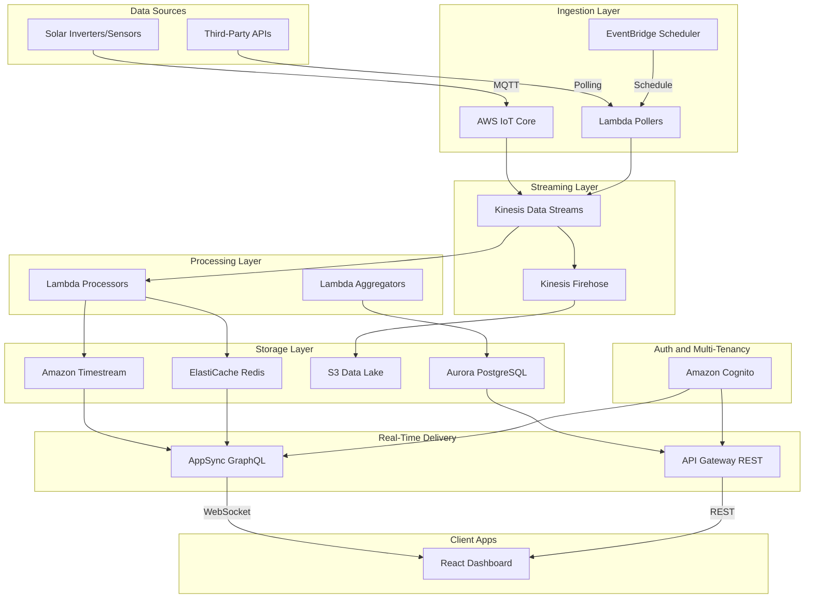
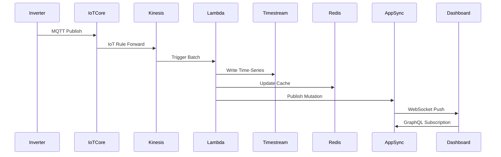

# AWS Architecture for Real-Time Solar Monitoring SaaS

## Architecture Overview



---

## Component Details

### 1. Data Ingestion Layer

**AWS IoT Core** (for direct sensor/inverter data)

- Inverters publish via MQTT with device certificates
- IoT Rules route messages directly to Kinesis
- Device shadows for offline state management
- Cost: ~$1 per million messages

**EventBridge + Lambda** (for third-party API polling)

- EventBridge Scheduler triggers Lambda every 1-5 minutes per plant
- Lambda functions poll SolarEdge, Enphase, FusionSolar APIs
- Results pushed to same Kinesis stream
- Handles rate limiting, retries, and API key management via Secrets Manager

### 2. Streaming Layer

**Kinesis Data Streams**

- Central data highway - all data flows through here
- 2-4 shards for medium scale (~1000 records/minute)
- 24-hour retention for replay capability
- Enables multiple consumers (real-time + batch)
- Cost: ~$15/shard/month + data costs

**Kinesis Firehose**

- Buffers and delivers raw data to S3 (data lake)
- Automatic partitioning by date and tenant
- Enables historical analysis and ML training later

### 3. Processing Layer

**Lambda Processors**

- Triggered by Kinesis with batching (100 records or 1 second)
- Transforms, validates, enriches data
- Writes to Timestream (time-series) and Redis (cache)
- Handles multi-tenant tagging (`tenant_id` on every record)

**Lambda Aggregators**

- Scheduled every 5 minutes
- Computes KPIs, aggregates, alerts
- Updates Aurora with summary data

### 4. Storage Layer

**Amazon Timestream** (time-series database)

- Purpose-built for IoT time-series data
- Automatic tiering (memory -> magnetic)
- Native time-series functions (interpolation, smoothing)
- Multi-tenant via dimension: `tenant_id`
- Cost: ~$0.50/GB ingested, $0.01/GB-month storage

**Aurora PostgreSQL** (relational data)

- Clients, plants, users, billing, subscriptions
- Row-level security (RLS) for multi-tenant isolation
- Serverless v2 for cost optimization
- Schema example:

```sql
-- Tenants/Clients
CREATE TABLE tenants (
    id UUID PRIMARY KEY,
    name VARCHAR(255),
    billing_plan VARCHAR(50),
    created_at TIMESTAMP
);

-- Plants
CREATE TABLE plants (
    id UUID PRIMARY KEY,
    tenant_id UUID REFERENCES tenants(id),
    name VARCHAR(255),
    location VARCHAR(255),
    capacity_kwp DECIMAL,
    data_source VARCHAR(50), -- 'iot' or 'api:solarEdge'
    api_credentials_secret_arn VARCHAR(500)
);

-- Enable RLS
ALTER TABLE plants ENABLE ROW LEVEL SECURITY;
CREATE POLICY tenant_isolation ON plants
    USING (tenant_id = current_setting('app.tenant_id')::UUID);
```

**ElastiCache Redis** (hot data cache)

- Latest readings per plant (sub-second access)
- Real-time dashboard data
- TTL: 5-10 minutes
- Cost: ~$25/month for cache.t3.micro

**S3** (data lake)

- Raw data archive (Firehose delivery)
- Partitioned: `s3://bucket/raw/{tenant_id}/{year}/{month}/{day}/`
- Lifecycle: Move to Glacier after 90 days
- Enables future ML/analytics

### 5. Real-Time Delivery Layer

**AWS AppSync** (recommended for real-time)

- GraphQL API with WebSocket subscriptions
- Native Cognito integration
- Resolvers connect to Timestream, Aurora, Redis
- Subscription example:

```graphql
type Subscription {
    onPlantUpdate(plantId: ID!): PlantReading
    @aws_subscribe(mutations: ["publishPlantReading"])
}

type PlantReading {
    plantId: ID!
    timestamp: AWSDateTime!
    power: Float!
    expectedPower: Float!
    performanceRatio: Float!
    soiling: Float!
}
```

**API Gateway** (REST endpoints)

- Historical data queries
- Admin operations
- Billing webhooks

### 6. Authentication and Multi-Tenancy

**Amazon Cognito**

- User Pools for authentication
- Custom attributes: `tenant_id`, `role`
- JWT tokens include tenant context
- Social login optional (Google, Microsoft)

**Multi-Tenant Isolation Strategy**

- Every table/record tagged with `tenant_id`
- Cognito JWT decoded in Lambda/AppSync
- RLS in Aurora, dimension filtering in Timestream
- S3 paths include tenant_id

### 7. Billing, Logging, and Monitoring

**CloudWatch**

- Metrics: Ingestion rate, processing latency, errors
- Logs: Lambda executions, API calls
- Alarms: Data gaps, high error rates

**CloudTrail**

- Audit logs for compliance
- Who accessed what, when

**DynamoDB or Aurora** (billing events)

- Track API calls per tenant
- Data ingestion volume per tenant
- Subscription status

---

## Data Flow Summary



---

## Estimated Costs (Medium Scale: 50 plants, 1000 points/min)

| Service            | Monthly Cost          |
| ------------------ | --------------------- |
| IoT Core           | $5-15                 |
| Kinesis (2 shards) | $30-50                |
| Lambda             | $10-30                |
| Timestream         | $50-100               |
| Aurora Serverless  | $50-150               |
| ElastiCache        | $25-50                |
| AppSync            | $20-40                |
| S3                 | $5-20                 |
| Cognito            | Free tier (50K users) |
| **Total**          | **~$200-450/month**   |

---

## Implementation Phases

### Phase 1: Core Infrastructure

- Set up VPC, Cognito, Aurora
- Deploy basic API Gateway + Lambda for auth
- Create tenant and plant tables

### Phase 2: Data Ingestion

- Configure IoT Core for direct sensors
- Build Lambda pollers for third-party APIs
- Set up Kinesis stream

### Phase 3: Processing and Storage

- Deploy processing Lambdas
- Configure Timestream database
- Set up Redis cache

### Phase 4: Real-Time Delivery

- Implement AppSync with subscriptions
- Build GraphQL resolvers
- Connect frontend to WebSocket

### Phase 5: Billing and Monitoring

- Implement usage tracking
- Set up CloudWatch dashboards
- Configure alerts

---

## Key Files to Modify

Current codebase changes needed:

- `backend/server.js` - Replace with Lambda handlers
- `backend/data/simulator.js` - Remove (real data replaces simulation)
- `frontend/src/api/solarApi.js` - Switch to AppSync client
- Add: Infrastructure as Code (CDK or Terraform)

---

## Alternative Considerations

**If budget is tight**: Use API Gateway WebSockets instead of AppSync (~30% cheaper)

**If scale grows significantly**: Consider Amazon Managed Streaming for Kafka (MSK) instead of Kinesis

**If latency is critical** (<100ms): Add AWS Global Accelerator for edge routing
